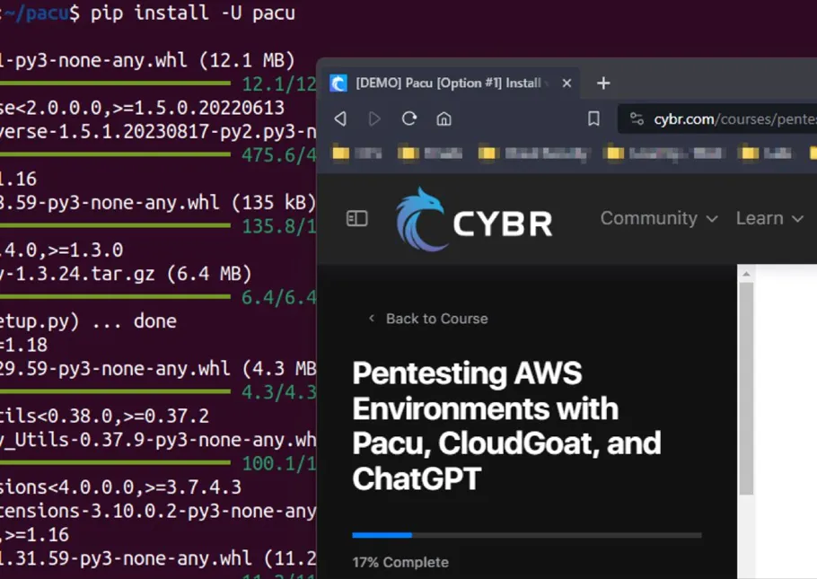

# AWS IAM Privilege Escalation: Oopsie, Your Policies Are a Mess!

So, like, AWS IAM (Identity and Access Management) is supposed to keep things locked down, but sometimes, those policies are a *hot mess*, letting attackers go from "barely-there" access to full-blown admin. Yikes!

## What’s the Tea? 
Privilege escalation happens when bad IAM policies let users gain more permissions than they should. Think of it like a VIP club pass that suddenly lets you into the manager’s office (bad idea, babe!).

## How It Happens
1. **Overly Permissive Policies** – Like, *who* is giving `iam:PassRole` to users without thinking?!
2. **Privilege Chain Reactions** – A little permission here, a little there, and boom—you own the whole AWS account.
3. **Policy Misconfigurations** – If you’re allowing users to edit their own roles, you might as well hand them the keys to the kingdom.

## How to Keep It Cute and Secure
- Follow the **least privilege principle**—only give permissions that are *actually* needed.
- Review IAM policies like you review a guy’s text messages: **thoroughly and with skepticism**.
- Use AWS Security Hub and IAM Access Analyzer to catch shady setups before they ruin your cloud vibes.

Stay cyber-safe, babes!
