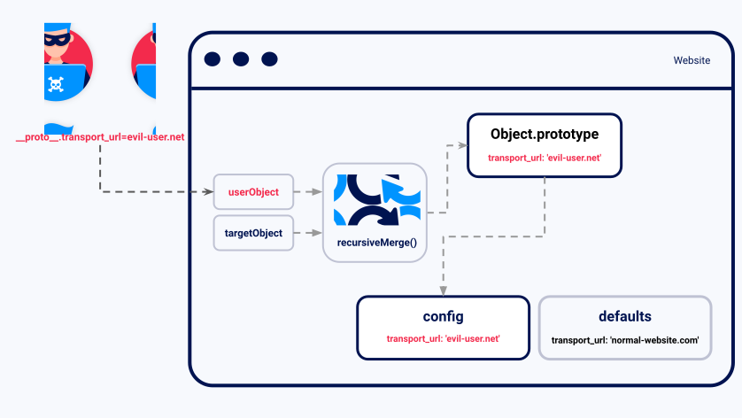

So, like, JavaScript is super cute and all, but did you know it has a little problem called **Prototype Pollution**? Basically, it’s when attackers mess with the way JavaScript objects work, and suddenly, they have full control over your web app. Ugh, rude!

## What’s the Drama?
JavaScript objects inherit properties from something called a **prototype** (think of it like a designer handbag collection—everything in the same brand shares the same style). But when hackers sneak in and start modifying these prototypes, they can change how *everything* in your app behaves. And trust me, that is *not* the kind of customization we want!

## How It Happens
1. **User Input Gone Wild** – Some apps let users send JSON data that directly changes object properties, like `__proto__`.  
2. **No Property Checks** – If developers don’t validate inputs, attackers can add unexpected properties, breaking security.  
3. **Full Takeover** – Hackers can inject malicious code, bypass security rules, and even turn your app into their playground. Yikes!

## How to Keep It Secure & Stylish
- **Validate user input** – Only accept data that makes sense, just like only texting back guys who *deserve* your attention.
- **Freeze Object Prototypes** – Use `Object.freeze(Object.prototype)` to stop shady modifications.
- **Use Secure Libraries** – Some JavaScript libraries are total drama queens when it comes to security—pick the good ones!

Stay fabulous and keep your web apps locked down, babes! 💻✨
