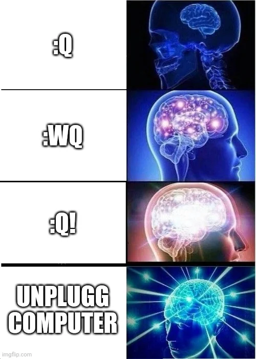

 

Okay babes, let’s talk **VIM**—the text editor that feels like it was designed as a hacker initiation test. You open it, and suddenly you’re trapped with no idea how to leave. Been there, done that. But don’t worry, I’ve got you! Let’s break it down so you can code, edit, and exit without having a meltdown. 💅

## Step 1: Opening VIM (The Easy Part)
If you wanna start VIM, just type:
```bash
vim filename.txt
```
Boom, you’re in. But now what?!

## Step 2: Understanding Modes (Because, Of Course, There Are Modes)
VIM has different modes, which is why it’s soooo extra:
- **Normal Mode** – This is where you navigate and do fancy commands (press `Esc` to get here).
- **Insert Mode** – This is for actually typing text (press `i` to enter it).
- **Command Mode** – This is where you tell VIM what to do (press `:` to enter commands).

## Step 3: Actually Typing (Because That’s the Point, Right?)
Press `i` to get into **Insert Mode** and start typing like a normal human. 

When you’re done, hit `Esc` to go back to **Normal Mode**. Yes, you have to tell VIM you’re done typing—she’s needy like that.

## Step 4: Saving & Quitting (The Real Struggle)
Okay, bestie, here’s how to actually leave VIM **without** crying:
- `:w` → Save the file (Write it to disk).
- `:q` → Quit (If you didn’t make changes).
- `:wq` → Save **and** quit (the safe option).
- `:q!` → Quit **without saving** (for when things go horribly wrong).

## Step 5: Moving Around Like a Pro
Forget arrow keys—real VIM queens use these:
- `h` → Left
- `l` → Right
- `j` → Down
- `k` → Up

Or just use the arrow keys like a rebel. 🤷‍♀️

## Step 6: Deleting, Copying & Pasting
- `dd` → Delete a whole line (gone, poof!).
- `yy` → Copy a line (aka yank it).
- `p` → Paste it below.
- `x` → Delete a single character (for tiny oopsies).

## Final Thoughts
VIM is like a toxic relationship—you struggle at first, but once you learn the rules, you’ll never want to leave. Stick with it, and soon you’ll be editing like a true hacker queen. 💻✨ 

- P.S. Sweeties, I've also started a personal live blog to share my glam pics and shopping hauls. The last thing I bought? This **fancy keyboard**—isn't she just STUNNING?! Look at this beautyyyyyyy!
   


XOXO, 
Your Cyber Bimbo
