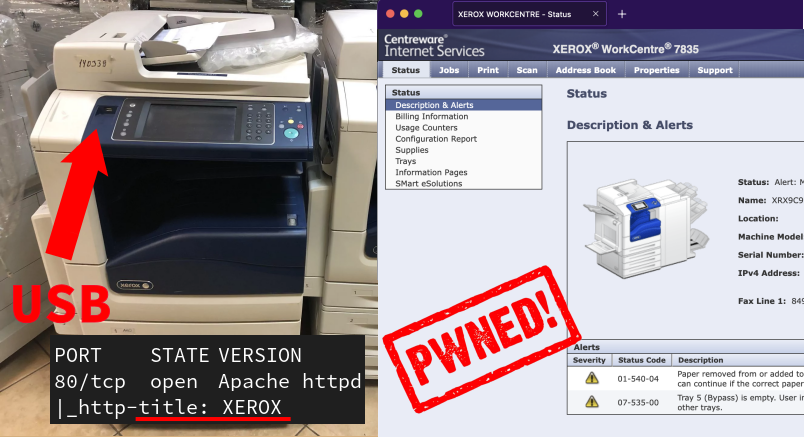

# Inside Xerox WorkCentre: Two Unauthenticated RCEs  
  

## What Happened?  
Imagine this: a regular office printer sitting quietly in the corner, just waiting for someone to exploit it. Sounds unlikely, right? Well, researchers recently found **two unauthenticated Remote Code Execution (RCE) vulnerabilities** in **Xerox WorkCentre** printers. That means attackers could **run any command on these printers remotely**—without needing a password. Not great news if you're using one of these devices in your office.  

## The Vulnerabilities: What Went Wrong?  

### 1. The `configrui.php` Exploit
- **What’s the issue?** Poor input validation in `configrui.php` allows attackers to inject malicious commands through the `param` field.  
- **How does it work?** An attacker can send a **crafted HTTP POST request** to `/support/remoteUI/configrui.php`, which then executes the injected command.  

### 2. Preprocessor Directive Injection
- **What’s the issue?** Some PHP files in the firmware don’t handle preprocessor directives securely, opening the door for attackers to sneak in their own code.  
- **How does it work?** Malicious requests can exploit these preprocessor directives to execute commands remotely before the PHP script even runs properly.  

## Why This Matters  
- **Who's affected?** Xerox WorkCentre printers running outdated firmware (pre-2016 patch).  
- **How bad is it?** **Critical.** Attackers can:
  - Gain full control over the printer.
  - Access sensitive scanned documents.
  - Use the printer as a foothold to attack other internal systems.  

## What You Should Do  
- **Update Firmware** – Check for the latest firmware from Xerox and install it ASAP.  
- **Restrict Access** – Limit who can reach the printer’s web interface using network rules.  
- **Monitor Traffic** – Keep an eye on logs for suspicious activity.  
- **Segment Your Network** – Don’t let your printers sit on the same network as sensitive systems.  

## Final Thoughts  
Printers aren’t just dumb paper machines anymore—they’re fully networked computers, and they **need proper security** like any other device. If you have a Xerox WorkCentre in your environment, take these vulnerabilities seriously and patch them now before someone else finds them first.  

---  

*References:*  
- [Raphaël Rigo, 2020](https://airbus-seclab.github.io/xerox/INFILTRATE2020-RIGO-Xerox-final.pdf)  
